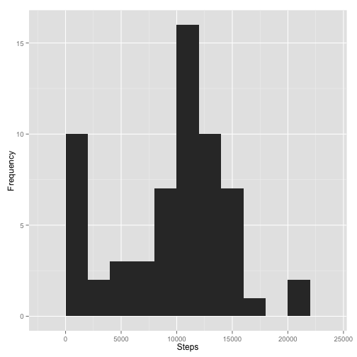
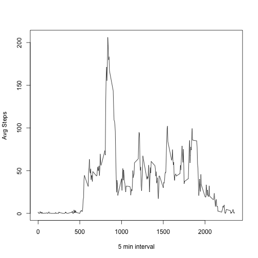
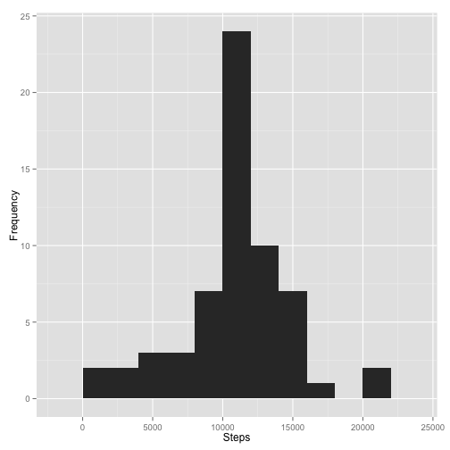
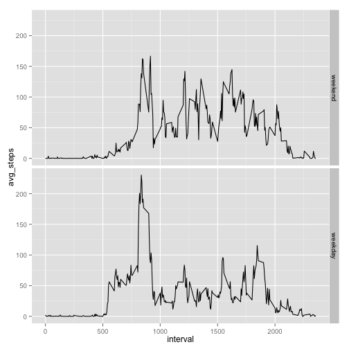

## Loading and preprocessing the data


```r
library(plyr)
library(ggplot2)
setwd("~/edu/datasciencecoursera/05 - Reproducible Research/RepData_PeerAssessment1")
unzip(zipfile = "repdata-data-activity.zip")
activity <- read.csv("activity.csv")
activity$n_date = as.Date(activity$date, format = "%Y-%m-%d")
```

## What is mean total number of steps taken per day?


```r
day_steps <- ddply(activity, .(n_date), summarize, steps = sum(steps, na.rm = TRUE))
```

Make a histogram of the total number of steps taken each day


```r
qplot(day_steps$steps, binwidth=2000, geo="histogram", xlab="Steps", ylab="Frequency")
```

 

Calculate and report the mean and median of the total number of steps taken per day


```r
mean(day_steps$steps)
```

```
## [1] 9354.23
```

```r
median(day_steps$steps)
```

```
## [1] 10395
```
## What is the average daily activity pattern?

Make a time series plot (i.e. type = "l") of:

1. the 5-minute interval (x-axis) 

1. and the average number of steps taken, averaged across all days (y-axis)


```r
daily_avg <- ddply(activity, .(interval), summarize, steps = mean(steps, na.rm = TRUE))
with(daily_avg,plot(interval,steps, type = "l", xlab = "5 min interval", ylab = "Avg Steps"))
```

 

Which 5-minute interval, on average across all the days in the dataset, contains the maximum number of steps?


```r
daily_avg[which.max(daily_avg$steps),]
```

```
##     interval    steps
## 104      835 206.1698
```

## Inputting missing values

Calculate and report the total number of missing values in the dataset (i.e. the total number of rows with NAs)

```r
missing <- is.na(activity)
table(missing)
```

```
## missing
## FALSE  TRUE 
## 67968  2304
```
Create a new dataset that is equal to the original dataset but with the missing data filled in (using the mean for that 5-minute interval).

```r
activity.filled <- activity
for (i in 1:length(activity.filled$steps))
    {if (is.na(activity.filled[i,1]))
        {activity.filled$steps[i] <- daily_avg$steps[which(daily_avg$interval == activity.filled$interval[i])]
        }
    }
```
Make a histogram of the total number of steps taken each day and calculate and report the mean and median total number of steps taken per day. 

```r
day_steps.filled <- ddply(activity.filled,  .(n_date), summarize, steps = sum(steps, na.rm = TRUE))
qplot(day_steps.filled$steps, binwidth=2000, geo="histogram", xlab="Steps", ylab="Frequency")
```

 

```r
mean(day_steps.filled)
```

```
## Warning in mean.default(day_steps.filled): argument is not numeric or
## logical: returning NA
```

```
## [1] NA
```

```r
median(day_steps.filled)
```

```
## Error in median.default(day_steps.filled): need numeric data
```

## Are there differences in activity patterns between weekdays and weekends?

Create a new factor variable in the dataset with two levels - "weekday" and "weekend" indicating whether a given date is a weekday or weekend day.


```r
weekends <- c('Saturday', 'Sunday')
day_steps.filled$dow <- factor((weekdays(day_steps.filled$n_date) %in% weekends), 
                          levels=c(TRUE, FALSE), labels=c('weekend', 'weekday'))
```

Make a panel plot containing:

1. a time series plot (i.e. type = "l") of the 5-minute interval (x-axis), and

1. the average number of steps taken, averaged across all weekday days or weekend days (y-axis). 


```r
activity.filled$dow <- factor((weekdays(activity.filled$n_date) %in% weekends),
                               levels=c(TRUE, FALSE), labels=c('weekend', 'weekday'))
by_dow <- ddply(activity.filled, .(interval, dow), summarize, avg_steps = mean(steps))
qplot(interval, avg_steps, data = by_dow, geom = "line") + facet_grid(dow ~ .)
```

 
